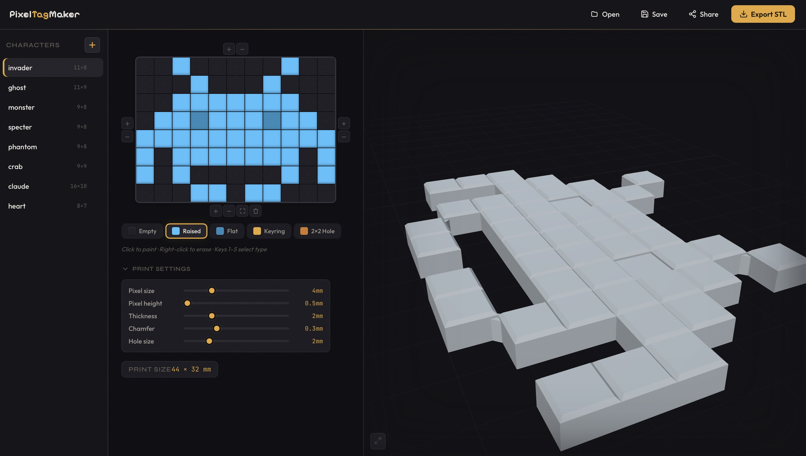

# PixelTagMaker

[framegrabber.github.io/PixelTagMaker](https://framegrabber.github.io/PixelTagMaker/)

Draw pixel art on a grid, get a 3D-printable STL keyring.

## Pixel types

| Key | Type | 3D result |
|-----|------|-----------|
| `1` | Empty | nothing |
| `2` | Raised | full-height block with chamfered top |
| `3` | Flat | shorter block, flush with the base |
| `4` | Keyring | raised block with a centered through-hole |
| `5` | 2×2 Hole | four pixels share one large hole at their shared corner — for small pixel sizes where a single-pixel hole is too tight |

## Features

- Click to paint, right-click to erase, drag to fill
- Edge controls to grow/shrink the grid one row or column at a time
- Trim to the bounding box of used pixels
- Print-size readout in mm (based on actual used pixels, not grid size)
- Print settings: pixel size, pixel height, base thickness, chamfer, hole size
- Character library: save/load as JSON, share via URL
- Export as binary STL (manifold, ready for FDM or resin printing)

## Tech

Runs entirely in the browser. No server, no account.

- [manifold-3d](https://github.com/elalish/manifold) (WASM) for CSG — guaranteed manifold output
- [Three.js](https://threejs.org) for 3D preview
- [React](https://react.dev) + [Vite](https://vitejs.dev)
